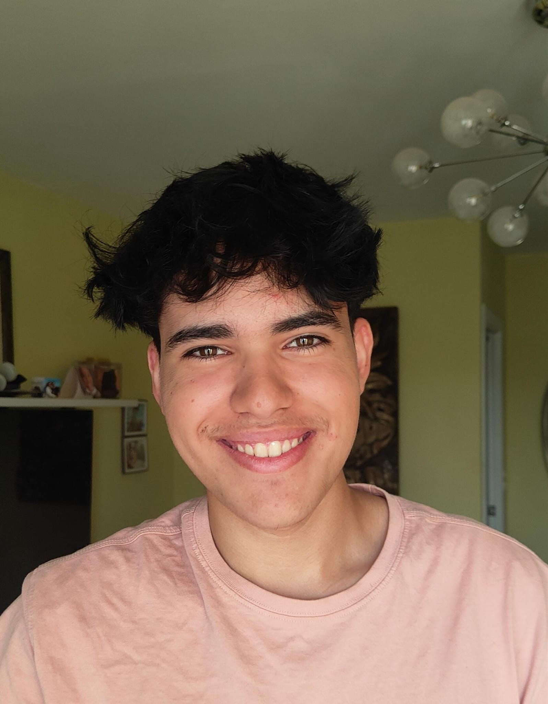

# Sobre mi
## Alejandro Gómez García

Naci en **Cuenca** aunque me mude a Córdoba hace ya dos años.

No tengo muchos hobbies aunque alguno de ellos podrían ser:

* Customizar teclados
* La informatica
* Viajar

No me gustan mucho las redes sociales, de hecho la unica que uso practicamente es *discord*.

La verdad que no hay ninguna cita que me emocione demasiado pero si tuviera que elegir una seria: 
> Un lector vive mil vidas el que no lee solo vive una
# Expectativas sobre el modulo

Puesto que son bastantantes las resumire en una lista ordenandolas por orden segun la importancia que les doy.

1. Aprender 
    1. Sobre todo me gustaria aprender bastante sobre programacion
2. Orientarme al mundo laboral
3. La titulacion de Grado superior
4. Hacer nuevas amistades.